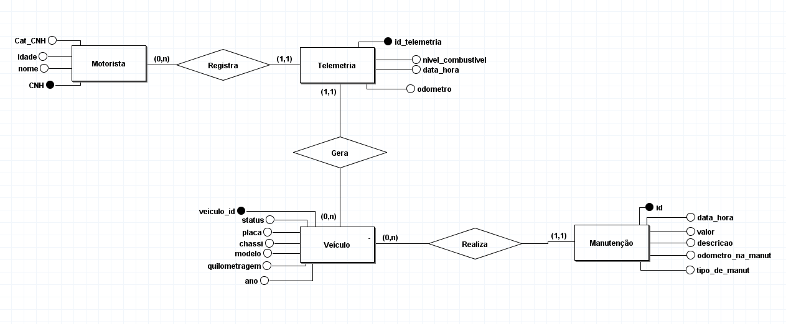

# 🚛 AutoMetrics — Automotive Telematics & Fleet Maintenance Engine

> **Solução de engenharia de dados e telemetria veicular voltada para automação de manutenções preventivas, auditoria de ativos e apuração de custos operacionais (Custo por KM).**

---

## 📌 1. Contexto e Problemática de Negócio

Empresas de transporte e logística operam em ritmos intensos, onde veículos utilitários e caminhões leves rodam entre **200 km e 450 km diariamente** em múltiplos turnos. 
Neste cenário de alta rotatividade, muitas frotas ainda dependem de controles manuais e analógicos:
* **Pranchetas de papel:** O odômetro e o nível de combustível são anotados manualmente pelos motoristas no final da viagem ou em postos de combustível.
* **Planilhas fragmentadas e estáticas:** Dados digitados dias após as operações geram defasagem e erros de digitação (odômetros digitados com dígitos a menos ou a mais).
* **Manutenção reativa ("Apagar Incêndios"):** A troca de óleo e filtros (que deveria ocorrer a cada 10.000 km) depende da memória humana.
  
### 🔥 O Impacto Financeiro do Problema

1. **Quebras Catastróficas:** Quando um veículo ultrapassa em 3.000 km a 5.000 km o intervalo de revisão, o risco de fundir o motor na rodovia dispara. Uma manutenção corretiva de motor fundido custa em média **R$ 28.000,00**, contra apenas **R$ 900,00** de uma revisão preventiva programada.
2. **Lucro Cessante:** Veículos parados na oficina por semanas causam atrasos em entregas, despesas com guincho e multas contratuais.
3. **Falta de Visibilidade de Custos:** A diretoria não consegue identificar quais modelos da frota estão gerando maior prejuízo por quilômetro rodado devido à ausência de cruzamento entre notas fiscais de oficinas e quilometragem percorrida.
   
---

## 🎯 2. A Solução: AutoMetrics

O **AutoMetrics** foi idealizado para centralizar o ciclo de vida dos ativos veiculares e transformar leituras de telemetria em ações automatizadas de preservação de frota.
O sistema atua em **4 pilares fundamentais**:
1. **Rastreabilidade de Ativos:** Cadastro centralizado de veículos (chassi, placa, modelo, ano, quilometragem acumulada) e condutores habilitados.
2. **Registro de Telemetria:** Captura de eventos pontuais (data/hora, odômetro do painel, nível de combustível e motorista responsável).
3. **Automação de Alertas Preventivos:** Verificação contínua do limiar de segurança ($$Odômetro Atual - Odômetro da Última Revisão \ge 10.000\text{ km}$$), sinalizando necessidade imediata de revisão.
4. **Inteligência de Custos (KPIs):** Cruzamento dinâmico entre o total investido em oficinas e a distância total percorrida pelo veículo para cálculo do **Custo por KM (R$/km)**.
   
---

## 🗄️ 3. Modelagem de Dados

### 📐 Diagrama Conceitual (Entidade-Relacionamento)

O modelo foi concebido no **brModelo**, respeitando as formas normais e a integridade referencial:

  
  
<em>Figura 1: Modelo Conceitual de Dados (brModelo).</em>

---

💼 4. Regras de Negócio e Decisões de Modelagem
Regra / Decisão	Justificativa de Engenharia
Vínculo Motorista ↔ Telemetria	Os motoristas alternam entre diferentes veículos da frota. O vínculo ocorre no momento da leitura/viagem, e não fixo no cadastro do veículo.
Histórico de Odômetro na Manutenção	Armazenar o odometro_na_manut permite calcular com precisão a quilometragem decorrida até a próxima intervenção preventiva.
Custos como Entidade Independente	Despesas não são atributos estáticos do veículo; cada manutenção é um registro histórico auditável com valor, peças e descrição do serviço.
Cálculo Dinâmico de Custo por KM	Não armazenado como coluna para evitar inconsistências. É gerado sob demanda via queries analíticas: SUM(valor) / quilometragem.
